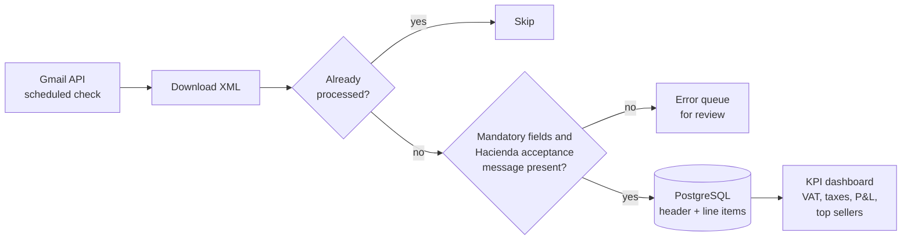
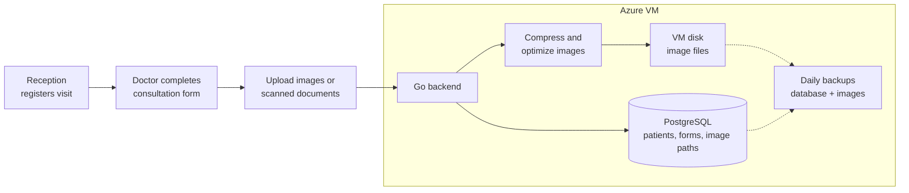
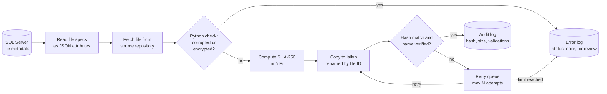

## Victor Ocampo Marin

**Data Engineer** based in Costa Rica. I build data-intensive systems with **SQL Server**, **ETL (SSIS, Apache NiFi)** and **Python**, and I'm currently expanding into **Databricks** and **Apache Spark**.

---

### About me

- 5 years in software and data: ETL pipelines, data ingestion, migrations, SQL tuning and cloud deployments on Azure.
- Today I'm responsible for data development across **three concurrent client projects** at a data outsourcing firm: data ingestion, file migration and SSIS migration.
- I design and build the **Apache NiFi** flows for two of those projects, including a pipeline that loads virtual machine logs into a database for analytics that feeds an AI agent.
- Before data engineering, I was a full stack engineer (C#/.NET, Go, Vue.js, Django), so I care about the whole path: from the source system to the person reading the dashboard.
- Spanish (native) · English (B2+, professional working proficiency).

### What I'm working on

- **Lakehouse project (in progress):** a Databricks lakehouse that ingests synthetic Costa Rican electronic invoices (XML), processes them through a medallion architecture (Bronze → Silver → Gold) with PySpark, applies data quality rules and models a star schema. → [`datalakehouse-practice`](https://github.com/VictorOcampo21/datalakehouse-practice)
- **Learning:** Databricks, Apache Spark (PySpark), Delta Lake and Microsoft Fabric.

### Tech stack

**Data engineering**

**Languages**

-336791?style=flat)

**Cloud & tools**

**Currently learning**

---

### Selected work

Most of my production work belongs to clients or organizations and its source code is private. Here is what I built, described without confidential details.

<b>FactuBot</b>: ETL bot for electronic invoices (Python, Django, Azure Database for PostgreSQL)

 

ETL bot used by multiple accountants, installed on each user's computer and backed by Azure Database for PostgreSQL. It collects electronic invoices from email, validates them against the requirements of Costa Rica's tax authority (Hacienda) and turns them into tax and sales KPIs.

- **Scheduled ingestion:** checks Gmail through the Gmail API daily by default, with a user-configurable schedule.
- **No duplicates:** queue-based processing keyed on each invoice's unique identifier; once processed, an XML is never picked up again.
- **Validation:** every mandatory field of Hacienda's XML structure, plus the presence of Hacienda's acceptance message for each invoice. Invoices that fail go to an error queue for review.
- **Data model:** Azure Database for PostgreSQL with separate header and line-item tables, so multi-line invoices are stored at line level.
- **KPIs:** VAT and other taxes, profit and loss, and top-selling items by category when the invoice includes one.

<b>OftaData</b>: multi-clinic patient records system in production (Go, Vue.js, PostgreSQL, Docker, Azure)

 

Built end to end for an ophthalmologist who works across five clinics in Costa Rica: database, backend, frontend and deployment. It centralizes every patient from every clinic in one system (1,000+ patient forms with medical images), used daily by the doctor and the reception staff.

- **Clinical workflow:** reception registers the patient or their arrival and opens the visit form; the doctor completes it during the consultation and attaches images or scanned paper documents.
- **Data model:** each patient has a profile, a clinical history (consultation forms) and a surgical history (signed surgery forms).
- **Images:** uploaded from the browser, compressed and optimized, stored on the VM's disk, with their paths kept in PostgreSQL.
- **Backups:** daily automated backups of the database and the images with 7-day retention, already used to restore data after real incidents.
- **Security:** role-based access, HTTPS with an SSL certificate, firewall rules on Azure, and controlled SSH access.
- **Appointments:** appointment calendar with WhatsApp reminders to patients.

<b>Metadata-driven file migration with integrity checks</b> (Apache NiFi, Python, SQL Server, Isilon)

 

Client project for a government judicial entity; details generalized for confidentiality. A NiFi flow migrates documents from source file repositories to Isilon storage, driven by a SQL Server metadata table that holds each file's specifications and location.

- **Validation:** Python scripts detect corrupted or encrypted files (PDF and other formats), which are not allowed in the flow.
- **Correct naming:** files are renamed by their file ID, and a Python script verifies the renaming.
- **Integrity check:** SHA-256 hash computed in NiFi at the source and verified at the destination.
- **Resilience:** failed transfers go to a retry queue capped at a maximum number of attempts.
- **Error handling:** every file that fails a check (corrupted, encrypted, or out of retries) is logged to an error table with an error status, so the client can review it and decide whether to re-fetch it from the source or discard it.
- **Traceability:** hash, size and validation results are written to SQL Server audit tables.

<b>Other client data projects</b>: ingestion and migration (Apache NiFi, SSIS)

 

- Log ingestion flow (in progress) for a government judicial entity: Apache NiFi collects application logs from multiple virtual machines, extracts the key fields and loads them into a database that the analytics team uses to feed KPIs to an AI support agent.
- Modernization of legacy SSIS ETL and SQL processes for a regional financial institution: adapting existing packages to new tables and servers, troubleshooting incremental loads and resolving data tickets.

---

### Certifications

- [Microsoft Certified: Azure Fundamentals (AZ-900)](https://learn.microsoft.com/es-mx/users/victormarin-8450/credentials/7c36f512f6349db9)
- [Oracle APEX Cloud Developer Certified Professional](https://catalog-education.oracle.com/ords/certview/sharebadge?id=48671B17B024B2A35CF7ED80C73E3FB2B38FF3BC221E991F5590BA8FC01C1BF1)
- [Certified Scrum Master, International Scrum Institute](https://www.scrum-institute.org/certifications/Scrum-Institute.Org-SMACea023cafa7-87462744894437.pdf)

### Let's connect

Open to Data Engineer opportunities (remote, hybrid or on-site). Reach me on [LinkedIn](https://www.linkedin.com/in/victor-ocampo-marin-69466122b) or at [victorocampomarin21@gmail.com](mailto:victorocampomarin21@gmail.com).
